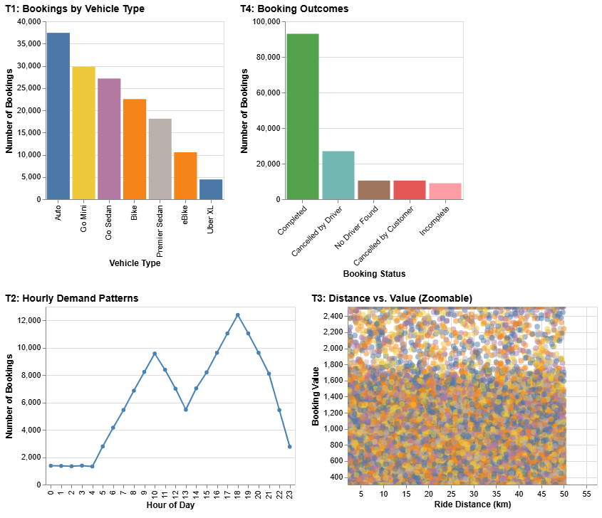
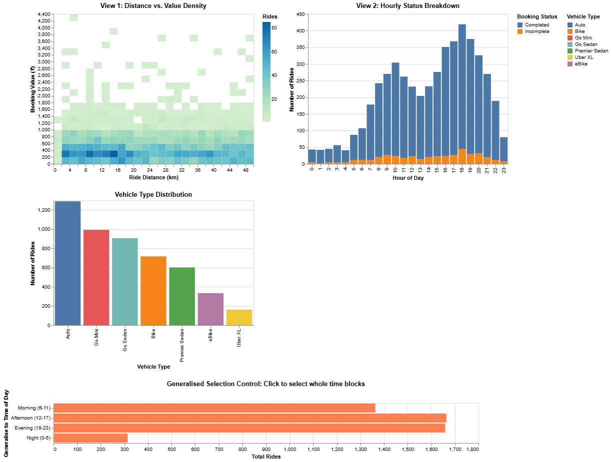
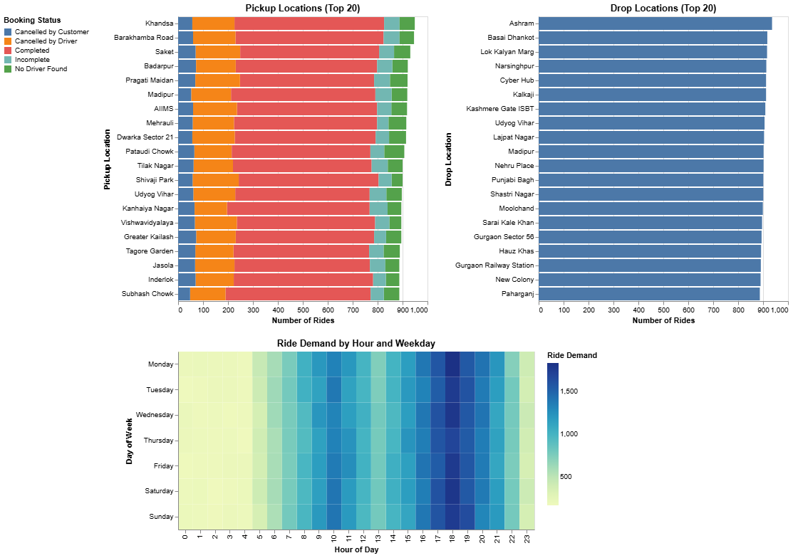

# Multiview Visualisation of Uber Ride Booking Behaviour Data

This repository contains a project for Information Visualization.  
The project explores Uber ride booking behaviour using three interactive multiview systems built with Python and Altair.

## Project Overview

We designed and evaluated three visualisation systems to support exploratory analysis of ride-hailing data.  
The systems focus on:

- ride demand across vehicle types
- temporal demand patterns
- relationship between ride distance and booking value
- booking outcomes
- interactive subset exploration

One of the systems also implements **generalised selection** through a temporal hierarchy.

## Systems

### System A — Demand Overview Dashboard
A standard multiview dashboard for fast and intuitive exploration.

Main features:
- bookings by vehicle type
- hourly demand patterns
- booking outcomes
- distance vs. booking value scatter plot
- click-based linked filtering

### System B — Density and Time Characterisation System
A more analytical system using density-based visualisation and hierarchical interaction.

Main features:
- distance vs. booking value heatmap
- hourly booking status distribution
- generalised selection by time of day
- brushing and coordinated filtering

### System C — Spatial and Temporal Ride Demand Dashboard
A location-focused system for origin–destination and temporal exploration.

Main features:
- top pickup locations
- top drop locations
- hour vs. weekday heatmap
- vehicle type filtering
- linked subset exploration

## Dataset

Dataset source:  
[Uber Ride Analytics Dashboard Dataset on Kaggle](https://www.kaggle.com/datasets/yashdevladdha/uber-ride-analytics-dashboard)

The dataset contains 150,000 ride booking records and 21 attributes, including:

- temporal attributes: date, time, hour, weekday
- categorical attributes: vehicle type, booking status, pickup and drop location
- quantitative attributes: ride distance, booking value, ratings

## Tasks Supported

The systems were designed to support the following tasks:

- **T1:** Compare ride demand across vehicle types
- **T2:** Analyse temporal patterns in ride demand
- **T3:** Explore the relationship between ride distance and booking value
- **T4:** Investigate booking outcomes and ride completion patterns
- **T5:** Select and explore subsets of rides

## Generalised Selection

System B implements generalised selection using a temporal hierarchy:

- Hour of day
- Time-of-day category:
  - Night
  - Morning
  - Afternoon
  - Evening

This allows users to move from detailed hourly analysis to broader temporal groupings.

## User Evaluation

We conducted a user evaluation with 5 participants and compared the three systems using:

- task completion time
- number of errors
- user preference

Summary of findings:

- **System A** was the fastest and easiest to use
- **System B** provided stronger analytical depth
- **System C** offered the strongest spatial insight, but was more complex to use

## Files

- `report/` — final report PDF
- `SystemA/` — source code for System A
- `SystemB/` — source code for System B
- `SystemC/` — source code for System C
- `images/` — screenshots used in this README

## Technologies Used

- Python
- Altair
- Pandas
- Jupyter Notebook

